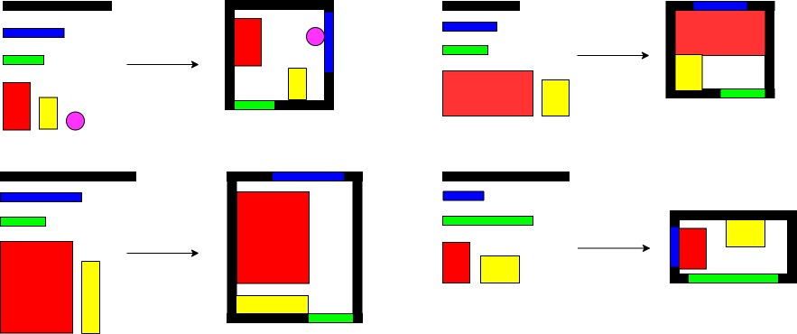

# Deep Reinforcement Learning for Furniture Layout Simulation in Indoor Graphics Scenes

## Installation
Please install the dependencies via conda:
 * PyTorch >= 1.0.0
 * networkx
 * numpy
 * Python >= 3.6

## Introduction

In the industrial interior design process, professional designers plan the size and position of furniture in a room to achieve a satisfactory design for selling. In this repository, we explore the interior graphics scenes design task as a Markov decision process (MDP), which is solved by deep reinforcement learning. The goal is to produce an accurate layout for the furniture in the indoor graphics scenes simulation. In particular, we first formulate the furniture layout task as a MDP problem by defining the state, action, and reward function. We then design the simulated environment and deploy a reinforcement learning (RL) agent that interacts with the environment to learn the optimal layout for the MDP. 

## Numerical results
We conduct our experiments on a large-scale real-world interior layout dataset that contains industrial designs from professional designers. Our numerical results demonstrate that the proposed model yields higher-quality layouts as compared with the state-of-art model. 

The figure below illustrate several examples of layouts produced by the state-of-the-art models. These layouts are for bedroom and tatami room. The ground truth layout in the simulator and the real-time renders can be found in the  first row. The layouts produced by the state-of-art models are shown in the second and third rows. It can be observed that the state-of-art model produces inaccurate position and size of the furniture.

We formulate the planning of furniture layout in the simulation of graphics indoor scenes as a Markov decision process (MDP) augmented with a goal state $G$ that we would like an agent to learn. We develop the simulator for the interior graphic indoor scenes. As shown in the figure below, we formulate the action, reward, policy and environment for the learning of the 2D furniture layout simulation.

Given the sizes and positions of the walls, windows, doors and furniture in a real room, the developed simulator transfers the real indoor scenes to simulated graphics indoor scenes. Different components are in different colors in the simulation.

Given a bathroom with random furniture positions, the trained RL agent is able to produce a good layout for the bathroom graphics scenes. The first row represents the the ground truth layoutfor a bathroom in the simulation and its corresponding render. The second row represents the bath-room with random furniture positions.  The third row represents the final layouts produced by our proposed method. The fourth row represents the corresponding layout renders.

Codes and more results will be released soon. Please contact deepearthgo@gmail.com if you have any questions.

